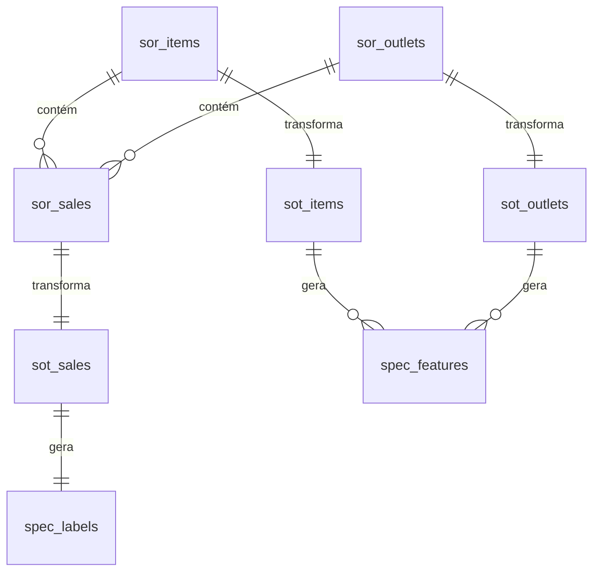

# MODELAGEM DE DADOS

## 1. Visão Geral

A modelagem de dados do projeto **BigMart Sales Chatbot MVP** segue a arquitetura **SOR → SOT → SPEC**, garantindo rastreabilidade desde os dados brutos até as features utilizadas nos modelos de Machine Learning.

* **SOR (System of Record)**: Armazena os dados brutos extraídos do `Train.csv`.
* **SOT (System of Truth)**: Camada tratada, com imputações de valores ausentes e normalizações.
* **SPEC (Specific ML Dataset)**: Conjunto final de features e labels para treino dos modelos.

---

## 2. Modelagem Lógica

### 🔹 SOR — Dados Brutos

#### `sor_items`

| Coluna             | Tipo        | Descrição                               |
| ------------------ | ----------- | --------------------------------------- |
| Item\_Identifier   | VARCHAR(10) | Identificador único do item (**PK**)    |
| Item\_Weight       | FLOAT       | Peso do item                            |
| Item\_Fat\_Content | VARCHAR(20) | Tipo de gordura (Low Fat, Regular, etc) |
| Item\_Visibility   | FLOAT       | Percentual de visibilidade do item      |
| Item\_Type         | VARCHAR(50) | Categoria do item                       |
| Item\_MRP          | FLOAT       | Preço máximo de varejo                  |

#### `sor_outlets`

| Coluna                      | Tipo        | Descrição                                 |
| --------------------------- | ----------- | ----------------------------------------- |
| Outlet\_Identifier          | VARCHAR(10) | Identificador único do outlet (**PK**)    |
| Outlet\_Establishment\_Year | INT         | Ano de fundação                           |
| Outlet\_Size                | VARCHAR(20) | Tamanho (Small, Medium, High)             |
| Outlet\_Location\_Type      | VARCHAR(20) | Localização (Tier 1, Tier 2, Tier 3)      |
| Outlet\_Type                | VARCHAR(50) | Tipo de loja (Grocery, Supermarket, etc.) |

#### `sor_sales`

| Coluna              | Tipo        | Descrição                            |
| ------------------- | ----------- | ------------------------------------ |
| Sale\_ID            | INT AUTO PK | Identificador único da venda         |
| Item\_Identifier    | VARCHAR(10) | FK → `sor_items.Item_Identifier`     |
| Outlet\_Identifier  | VARCHAR(10) | FK → `sor_outlets.Outlet_Identifier` |
| Item\_Outlet\_Sales | FLOAT       | Vendas realizadas                    |

---

### 🔹 SOT — Dados Tratados

* Aplica limpeza de `NaN`, normalização de categorias (`Item_Fat_Content` → padronizado) e imputação de valores (ex.: média do peso por tipo de item).

#### `sot_items`

Mesma estrutura de `sor_items`, mas sem valores nulos.

#### `sot_outlets`

Mesma estrutura de `sor_outlets`, com `Outlet_Size` imputado quando ausente.

#### `sot_sales`

Mesma estrutura de `sor_sales`.

---

### 🔹 SPEC — Dataset para ML

#### `spec_features`

| Coluna                 | Tipo        | Descrição                                |
| ---------------------- | ----------- | ---------------------------------------- |
| Item\_Identifier       | VARCHAR(10) | Identificador do item                    |
| Outlet\_Identifier     | VARCHAR(10) | Identificador do outlet                  |
| Item\_Weight           | FLOAT       | Peso imputado                            |
| Item\_Fat\_Content     | INT         | Codificação (0=Low Fat, 1=Regular, etc.) |
| Item\_Visibility\_Bin  | INT         | Binário (0=Baixa visibilidade, 1=Alta)   |
| Item\_Type             | INT         | Codificado One-Hot                       |
| Item\_MRP              | FLOAT       | Preço                                    |
| Outlet\_Size           | INT         | Codificado One-Hot                       |
| Outlet\_Location\_Type | INT         | Codificado One-Hot                       |
| Outlet\_Type           | INT         | Codificado One-Hot                       |

#### `spec_labels`

| Coluna              | Tipo  | Descrição                                 |
| ------------------- | ----- | ----------------------------------------- |
| Item\_Outlet\_Sales | FLOAT | Label para regressão (previsão de vendas) |
| High\_Visibility    | INT   | Label para classificação (0/1)            |

---

## 3. Relacionamentos

---

## 4. Perguntas Respondidas

* **Regressão Linear (Y = Item\_Outlet\_Sales)**
  *“Qual é a previsão de vendas de um item considerando características do produto e do outlet?”*

* **Regressão Logística (Y = High\_Visibility)**
  *“Um item terá alta ou baixa visibilidade dependendo do tipo de loja e da localização?”*

---

## 5. Governança

* Dados **SOR** nunca são alterados (somente leitura).
* Dados **SOT** podem sofrer regras de imputação e limpeza.
* Dados **SPEC** são descartáveis e podem ser reconstruídos a qualquer momento.

---